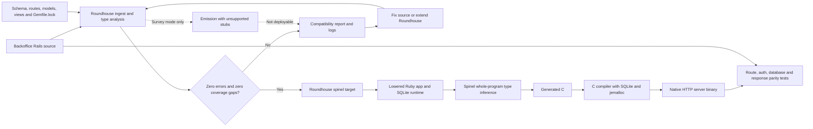

# Backoffice compilation pipeline

The normal path is deliberately strict: Roundhouse must understand the source
before it emits code that Spinel can compile. The survey branch is useful for
seeing the full error inventory, but it may contain generated stubs and must
never be deployed or used as evidence of behavioural parity.
